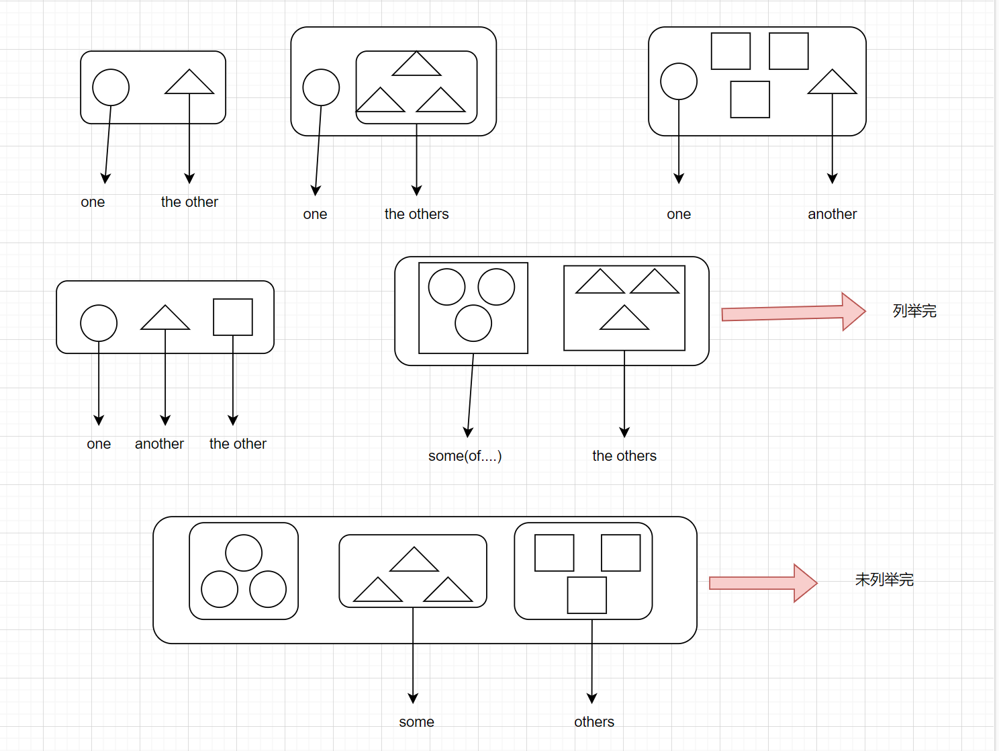

## unit04 代名词

#### 一、人称代名词

<table align="center">
    <tr><td rowspan="2">人称、格</td><td colspan="3" align="center">单数</td><td colspan="3" align="center">复数</td></tr>
    <tr><td>主格</td><td>所有格</td><td>受格</td><td>主格</td><td>所有格</td><td>受格</td></tr>
    <tr><td>第一人称</td><td>I</td><td>My</td><td>me</td><td>We</td><td>our</td><td>us</td></tr>
    <tr><td>第二人称</td><td>you</td><td>your</td><td>you</td><td>you</td><td>your</td><td>you</td></tr>
    <tr><td rowspan="3">第三人称</td><td>he</td><td>his</td><td>him</td><td rowspan="3">they</td><td rowspan="3">their</td><td rowspan="3">them</td></tr>
    <tr><td>she</td><td>her</td><td>her</td></tr>
    <tr><td>it</td><td>its</td><td>it</td></tr>
</table>

##### 1.1 主格、所有格、受格的用法

###### 1.1.1 主格 + 动词

- He likes sports.

###### 1.1.2 所有格 + 名词

- His friends are over there.

###### 1.1.3 一般动词 + 受格

- The girl loves him very much.

###### 1.1.4 介系词 + 受格

特例：

- A：Who is it?  A站在房子里问是谁？（里面看不到人，无法确定对象，使用it）

  B：It's I. / It's me.

##### 1.2 it的用法

###### 1.2.1 可以表示天气、时间、距离等

- It rains a lot in Taipei in spring.

  台北的春天下很多雨。

- It was two o'clock when he came back home.

  当他回到家的时候，已经两点了。

- It is five kilometers from here to the airport.

  从这里到机场有5公里的距离。

###### 1.2.2 it可以表示某一状况（多半是说话人和听的人都能了解的特定状况）

- A：Who knocked at the door？谁在敲门？

  B：I thought it was jack.  我认为是Jack.

- It's all up to you.  一切由你决定。

- I like it here. 我喜欢这里。 // here是副词，不能做受词，需要用it.

- I don't feel like it.  我不想。 // it指某种状况，feel like：想要

###### 1.2.3 it可以当假主词，代替一件事

- It is difficult `to learn Spanish.` `学西班牙语`是困难的。
- It's important `that you should tell the truth.`  `你应该说实话`这件事很重要。
- It's no use `telling him about it.` `告诉他这件事`是没有用的。

##### 1.3 We、You、They的特殊用法

- We had a heavy rain yesterday.  我这里昨天下了一场大雨。
- You don't see many Chinese there. 在那里看不到很多中国人。// 你不一定去过
- They speak English in Canda.  加拿大人说英文。

#### 二、所有代名词

<table align="center">
   <tr><td rowspan="2">人称、格</td><td colspan="2" align="center">单数</td><td colspan="2" align="center">复数</td></tr>
    <tr><td>所有格</td><td>所有代名词</td><td>所有格</td><td>所有代名词</td></tr>
    <tr><td>第一人称</td><td>my</td><td>mine</td><td>our</td><td>ours</td></tr>
    <tr><td>第二人称</td><td>your</td><td>yours</td><td>your</td><td>yours</td></tr>
    <tr><td rowspan="3">第三人称</td><td>his</td><td>his</td><td rowspan="3">their</td><td rowspan="3">theirs</td></tr>
    <tr><td>her</td><td>hers</td></tr>
    <tr><td>its</td><td>its</td></tr>
</table>

##### 2.1 所有代名词的用法

> 所有代名词 = 所有格 + 名词

- Your house is bigger than mine.  // mine = my house

  你的房子比我的大。

- My bicycles are here and his are there. // his = his bicycles

  我的脚踏车在这里，他的（脚踏车）在那里。

##### 2.2 伴随双重所有格

> 冠词、所有格、指示形容词（this、that）、不定形容词（many）不可以同时放在名词的前面

- I met one of my old friends on the way home.

  = I met an old friend of mine on the way home. // mine = my friends

  我在回家的路上遇见我的一位老朋友。

##### 2.3 名词的所有代名词 = 所有格

- My dogs is black, and Jason's is white. // Jason's等于Jason's dog

  我的狗是黑色的，Jason的狗是白色的。

#### 三、反身代名词

##### 3.1 反身代名词的形成

> 第一、二人称：所有格 + self / selves

> 第三人称：受格 + self / selves

<table>
    <tr align="center"><td></td><td>单数</td><td>复数</td></tr>
    <tr><td>第一人称</td><td>myself(我自己)</td><td>ourselves(我们自己)</td></tr>
    <tr><td>第二人称</td><td>youself(你自己)</td><td>yourselves(你们自己)</td></tr>
    <tr><td>第三人称</td><td>himself、herself、itself</td><td>themselves</td></tr>
</table>

##### 3.2 反身代名词的用法

> 经常用于主语、受词对象相同的时候

- You always talk to `yourself.` 你总是自言自语。

- The little girl hurt `herself.` 这个小女孩伤到了她自己。

- He can do it by himself. = He himself can do it. （强调）

  他能靠自己完成这件事。

- I saw the singer `himself.` 我看到这个歌手本人。

#### 四、指示代名词

> 指示人或事物的代名词

##### 4.1 this（these）/ that（those）

###### 4.1.1 一般用法

> 代替人或事物，离说话者距离较近，用this（these），距离说话者较远使用that（those）

- This is my mask, and `that` is Mary's.

  这是我的面具，那是Mary的。

- Who is this？（电话用语）是谁啊？（自己接电话）

- Who was that on the telephone？

  电话里的那个人是谁啊？（询问打电话的人）

- Things are easier these days. 最近事情简单多了。

###### 4.1.2 代替用法

> 代替已经叙述过的字，代替单数名词使用that，代替复数名词使用those

- The weather in Beijing is cooler than `that` in ShangHai.

  北京的天气比上海更加凉爽。 // that代替前面出现过的the weather

- Her interests are different from those of her childhood.

  他的兴趣和他小时候不一样。  // those代替前面出现过的the interests 

##### 4.2 so

> 作为动词的受词或者补语，指前面出现过的字或者句子

- Will it be fine tomorrow？明天天气会好吗？

  I hope `so.` = I hope that `it will be fine tomorrow.` 

- Do you still feel sick？If `so`, you must see the doctor.

  你仍然不舒服吗？如果是这样，你必须去看医生。

- Nancy can play the violin, and so can I.

  Nancy会拉小提琴，并且我也会。// so can I. = I can, too.

- She is smart. So she is. 她很聪明，她的确如此。

  She is smart. So is he. 她很聪明，他也是。

##### 4.3 such

> 有"那样的事物、人"之意，可以当代名词、形容词，也可以用于单复数

- They will plant flowers `such as` roses, sunflowers.  // such as：例如

  他们要种一些花朵，例如：玫瑰、向日葵。

- I don't know such a man.

  我不认识那样的人。// such（a / an）+ （形容词）+ 名词

- Have you tasted `any` such food before？

  你以前有尝过任何这样的食物吗？

> such前面可以接all、other、another、any、few、every、no.....等

##### 4.4 same

> 一般都加the，表示"相同的事物"之意

- A：Can I have a cup of coffee, please？我能来一杯咖啡吗？

  B：Give me the same, please.  我也要一样的。

**注意：服务生现在一般用Server而不用waiter**

- He uses the same typewriter as I（do）. // do表示打字的动作

  他使用和我相同的打字机。

#### 五、不定代名词

> 表示不特定的人或物

> 表示非一定数量的代名词

- Some of the boys like English.

  这一些男孩喜欢英文。 // the定冠词表示限定

- Some boys like English.

  一些男孩喜欢英文。  // 没有限定

##### 5.1 one / ones

###### 5.1.1 one

> one = a / an + 单数名词：指不特定的人或物

- I have lost my watch and I have to buy one.  // one指代a watch

  我弄丢了我的手表，我必须买一只新的。

###### 5.1.2 ones

> 指不特定的人或物的复数

- I like small cars better than large ones.  // ones指代cars

  我喜欢小车子胜过大车子。

**注意：one = a / an + 单数名词     it = the + 单数名词** 

- Here are some apples. Take `one.`  这里有一些苹果，拿一个吧。

- I bought a good camera.  I'll lend `it` to you.

  我买了一台不错的相机，我会把这台相机借给你。// it等于the camera

##### 5.2 both / all

> 位置：be动词或者助动词之后，一般动词之前，定冠词（the）、所有格、数词、形容词之前

> both（两者都）：用于两个人或两个事物

> all（全部；所有的）：指数量为3或3个以上的人或事物，也可以代表不可数名词

- Both of her children went to New York.

  她的两个孩子都去过纽约。（她只有两个孩子）如果把both换成two，那么说明她不止两个孩子，只有其中的两个去过纽约。

- I've read both these papers. 我阅读过两份报纸。

- All of my money was stolen. 我所有的钱都被偷了。

- You may take all these toys.

  你可以拿走所有的玩具。 // all these toys = them all

**both、all出现在否定句，表示"部分否定"（并非.....）** 

- I don't know both of her parents.

  她的父母我并非都认识。（我只认识其中的一个）

  = I know just one of her parents.

- Not all of them come from England.

  他们并非全部都来自英格兰。

  = Just some of them come from England.

##### 5.3 some / any

###### 5.3.1 一般而言，some用于肯定句，any用于否定句、疑问句以及条件子句，可代替可数和不可数

- Some of the boys were late.  这些男孩中的一些迟到了。
- Some of my money was stolen from my purse. 我的一些钱从皮包中被偷走了。
- Please lend me some money if you have any. 请借给我一点钱，如果你有钱的话。
- Do you have any magazines to read? 你有任何杂志可以读吗？

###### 5.3.2 some的特殊用法：表示"请求，邀请"的问句

- Will you give me some help?

  请你给我一些帮助好吗？

- How about some tea？

  喝些茶如何？

##### 5.4 other / another

> other：表示其他（人；事物）之意，其复数为others（+ v.）

> another：从an + other衍生而来，表示不特定的另一个别的人、事物，注意没有复数型

- I have two students. One is short, the other is tall.

  我有两个学生。一个比较矮，另一个比较高。

- I have three flowers. 我有三朵花。

  One is red; the others are yellow. 一朵红色，两朵黄色。

  One is red; another is yellow; the other is pink. 一朵红色，一朵黄色，一朵粉色。

- I don't like this one, show me `another.` 

  我不喜欢这一个，请给我看另外一个。（总数 >= 3）

- I don't like this one, show me the other.

  我不喜欢这一个，请给我看另外一个。（总数 = 2）

- Some of the boys are here, but where are the others？

  一些男孩在这里，其他的到哪去了？

- Some people said yes and others said no.

  一些人说yes,另外一些人说no.

##### 5.5 other的总结

#### 六、其他

##### 6.1 none（无）、several（数个）、most（大部分）

- None of the telephones is working.

  没有一台电话可以工作。

- Several of my friends attended the meeting.

  我的朋友当中有几个参加了这次会议。

- Most of it is true.

  这件事大部分是真的。

- Most of the people know it.

  大部分的人都知道这件事。

##### 6.2 most可以当形容词，为many、much的最高级，前面可以加the

**注意：most解释成大部分时，不能加the** 

- Who got the most New Year's cards？

  谁得到了最多的新年贺卡呢？

- She is the most beautiful girl（that I've ever seen.）

  她是我曾经见过的最美丽的女孩。
