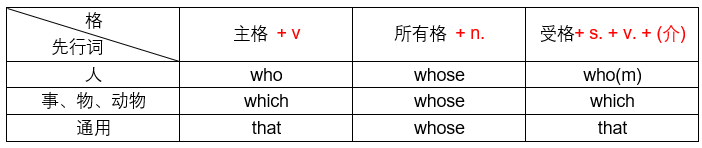

# unit17 关系代名词

## 一、关系代名词概述

#### 1.1 功用

> 等同于连接词 + 代名词 

- I have a friend. The friend lives in Pairs. 我有一个朋友，这个朋友住在巴黎。 

- I have a friend **and** he lives in Pairs. // 使用连接词，将两句合成一句

- I have a friend **who** lives in Pairs. // who等同于上句的and he 

<font color='blue'>关代连接的形容词子句可以看成形容词，主要是用来修饰主句中的成分的。</font>

```
问题：什么是形容词子句？ 
```

```
回答：形容词的主要作用是修饰名词，当形容词比较简单只有一个的时候，可以直接放在名词之前，当形容词比较复杂，不止一个词的时候则需要放在名词之后，比如上面那句，who作为主语，lives作为谓语，具有主词和动词可以构成一个句子，但其实是用来修饰前面的名词的时候，称其为形容词子句。
国语：住在巴黎的朋友。
英语：a friend [who lives in paris.] 形容词子句
```

#### 1.2 语顺

> 先行词 + 关系代名词， 但是也有下列句子

- There was an old man in the apartment who was very rich. 

  那栋公寓里有一个特别有钱的老人。

  `这句里的who并不是代替先行词apartment,而是指代old man`

  `in the apartment只是修饰语修饰old man` 

- I met two girls, one of ~~them~~ <u>whom</u> is my cousin.  // 需要使用关代，不然没有连接词

- I met two girls <u>and</u> one of <u>them</u> is my cousin.  // 已经有了连接词使用代名词即可

> 注意事项：关系代名词就是代替句子中的连接词 + 代名词，但是也有格的概念，比如who代替主格，whom则代替受格。

#### 1.3 关系代名词的种类



#### 1.4 格的用法

- 主格 + 动词 

  The man **who** talked to me. 

- 所有格 + 名词 

  The man whose car was stolen.

- 受格 + 主词 + 动词 

  The man who(m) I met. 


## 二、主格的关系代名词

#### 2.1 主格who

> 先行词（人）+ 主格关代who + 动词 

- 主句：The man is my father.  

  子句：The man wears sunglasses. 

  合并：The man [who wears sunglasses] is my father. 

- 主句：I don't like people. 

- 子句：They get out of temper easily. 

- 合并：I don't like people who get out of temper easily. 我不喜欢发脾气的人。

**使用关系代名词的步骤：** 

1. 找出句子中的主要成分
2. 判断句子中的修饰成分
3. 如果修饰成分也有主语和谓语，可以单独都成一个句子，则可以用关代将其连接
4. 紧跟在先行词的后面

**如何判断关系代名词应该用主格还是宾格：** 

关系代名词的作用就是用来代替代名词和连接词从而达到简化句子的目的，所以主要看其代替的先行词在子句中是主语的身份还是宾语的身份。

#### 2.2 主格which

> 先行词（事物；动物）+ 主格关代which + 动词 

- 主句：I live in the house. 

  子句：The house stand on the hill.

  合并：I live in the house which stands on the hill. 我住在那栋位于山坡的房子里面。

- 主句：English is a language. 

  子句：It is spoken all over the world. 

  合并：English is a language which is spoken all over the world. 

  英语是一种全世界都在说的语言。（英语是一门通用语言。）

#### 2.3 主格关代 that

> 先行词（人；事物；动物）+ 主格关代 that + 动词 

- People [who / that help doctors and look after patients] are called nurses. 

  [帮助医生照顾病人的]人称为护士。 // 前面的指示形容词子句 

  `patient当名词解释成“病人”，当形容词解释成有耐性的`     

- I like the building [which / that was designed by Mr.Wu. ] 

  我喜欢这栋[被吴先生设计出来的]大楼。

**注意事项：**主格关代后面所接的动词，需要和先行词一致。

- Tom is one of the boys [who are found of sports.] 

  Tom是这群喜欢运动的男孩中的一个。 // who是指代boys所以用are 

  `be found of 喜欢.......`    

- I know a child who is good at surfing. 

  我认识一个很会冲浪的小朋友。

  `be good at  精通`    

- Adults don't like children who tell lies. 

  大人不喜欢说谎的小朋友。 


## 三、that的不同用法

#### 3.1 指示代名词 -> 那

- The weather in ShangHai is hotter than that in Beijing. 

  上海的天气比北京更加炎热。 // that代替前面出现过的weather 

#### 3.2 指示形容词 

- Look at that dog. // that修饰后面的名词dog  

  看那一只狗。

#### 3.3 关系代名词

- The boy [that is playing the guitar] is Jimmy. 

  正在弹吉他的那个男孩是Jimmy. 

  `play the + 乐器、play + 运动` 注意定冠词the的使用 

#### 3.4 连接词

- I think that honesty is the best policy. 

  我认为城市为上策。

<font color='red'>问题：that有这么多种用法，如果判断其是连接词还是关代？</font>

1. 找出句子中所有的主词和动词
2. 判断是不是有两个主词或者两个动词，如果是，那么肯定需要使用连接词或者关代
3. 判断that有没有代替主词，如果that既是连接词又是一个主词，那么一定是关代
4. 如果that只是单纯连接两个主词和两个动词，那么就是连接词  


## 四、所有格的关系代名词 

> 所有格whose-> 先行词（人；事物；动物）+ 所有格关代whose + 名词 

- I know a girl. 

  Her father is a journalist. // her与a girl重复使用关代代替 

  合并：I know a girl whose father is a journalist. 

  我认识一位父亲是新闻记者的女孩。

- Look at the house. 

  Its roof was damaged. 

  合并：Look at the house whose roof was damaged. 

  看那一间屋顶受损的房子。

  `注意事项：roof自己并不是主词，而是主词的一部分，whose roof共同构成主词，所以这句并不能用受格关代。`     


## 五、受格的关系代名词 

#### 5.1 受格whom

> 先行词（人）+ 受格关代whom + S. + V. + (介) 

- The man is a teacher. 

  She married him. 

  合并：The man [who(m) she married] is a teacher. 

  她嫁的男人是一个老师。

**注意：关系代名词要紧跟先行词，受格关代一般又是代替子句中的受格，受格本来应该放在动词之后，为了让受格关代紧跟先行词，需要将受格关代抓到形容词子句的开头。**

- The woman has just left the office. 

  You want to see her. 

  合并：The woman [whom you want to see] has just left the office. 

  你想要看的那个女人刚刚离开办公室。 // whom代替her所以是受格

#### 5.2 受格which

> 先行词（事物；动物）+ 受格关代 which + S. + V. + (介) 

- Here is a magazine. 

  I borrowed it from Miss Wang. 

  合并：Here is a magazine [which I borrowed from Miss Wang.]

  这里有一本我从王小姐那里借的杂志。 // which替代it，其实就是magazine 

- Remember the advice. 

  I gave you the advice. 

  合并：Remember the advice [which I gave you.] 

  记住我给你的忠告。 // which替代the advice 

  a piece of advice. 一则忠告

  two pieces of advice. 两则忠告

#### 5.3 受格that

> 先行词（人；事物；动物）+ 受格关代that + S. + V. + （介词）

- The little girl is very cute. 

  My dad is taking to her. 

  合并：The little girl [whom / that my dad is talking to] is very cute. 

  正在和我爸爸说话的那个小女孩非常可爱。

- The sandwiches [that we ate for lunch] were not delicious. 

  [我们午餐吃的]三明治不好吃。 

  <font color='red'>eat + 物 for + 餐    表示.....餐吃.....(物) </font>

  We eat sandwiches for lunch. 我们午餐吃三明治。

#### 5.4 使用关系代名词的一般步骤

1. 找出两句中相同的部分，可能是主语，可能是宾语
2. 根据相同的成分在其所在子句中是主格还是宾格从而判断使用主格关代还是受格关代
3. 如果是主格关代直接将重复部分直接换成相应的关系代名词紧跟先行词，如果代替的部分有修饰语可以将主格关代放在修饰语的后面。
4. 如果是受格关代注意将关系代名词提前  

<font color='red'>注意：</font>在写句子的时候，并不会给你两个句子让你合并，要学会自己判断重复的部分，比如“我们午餐吃的三明治不好吃”，首先找出主语和谓语，组成一个简单的句子，`三明治不好吃`，剩余部分`我们午餐吃的`显示是一个形容词子句，子句中缺少受格，使用that提前引导。


## 六、特别注意的关系代名词

#### 6.1 受格关系代名词可以省略

- Soccer is the sport (which / that) I like (the) best. 

  足球是我最喜欢的运动。 `best是副词well的最高级，the可以省略`    

#### 6.2 受格关代和介系词连用的情况 

> 有时候受格关代代替名词需要和介系词连用，受格关代可以提前，介系词同样可以以前

<font color='red'>注意事项：</font> 当介系词提前时，受格关代原来是什么就是什么，不可以用that，也不能使用who等价，并且不可以省略。

- The woman [who(m) / that you are speaking of] is our principal. 

  The woman [of whom you are speaking] is our principal. 

  你提及的那个女人是我们的校长。// 受格关代提前whom不能被等价

- The train [`which / that` I am waiting for] is now half an hour late. 

  The train [for which I am waiting] is now half an hour late. 

  火车已经晚点半小时了。 // 介系词放在关代前，关代不可用that，也不能省略 

#### 6.3 关代只能用that的情况

##### 6.3.1 先行词前有最高级

- Today is the coldest day (that) we have ever experienced. 

  今天是我们经历过的最寒冷的一天。 // 受格关代that可以省略  

##### 6.3.2 先行词前面有序数

- Kenny was the first boy that rushed out of the classroom. 

  肯尼是首位[冲出教室的]男孩。// 主格关代that不可省略

##### 6.3.3 先行词为人，事物或者动物同时出现

- Take a look at the boy and his dog that are coming this way. 

  看一看朝着这个方向来的那个男孩和他的狗。 

  <font color='blue'>take a + 名词，代表一种动作或者行为，比如：take a trip、take a shower</font> 

##### 6.3.4 先行词前面有疑问词：who（谁）、which（哪一个）

> 主要是为了避免和疑问词重复

- Who [that has seen the photos of starving children] does not want to help them? 

  谁曾经看过那些饥饿的小孩的照片会不想要帮助他们呢？ 

  `who为疑问词，形容词子句显示是主格关代，应该使用who,为了和疑问词who避免重复，所以只能使用that` 

  <font color='red'>注意：</font>状况不明，视为单数

- Which was the bag [that you left in the train] ? 

  你留在火车上的袋子是哪一个呢？ 

  `which为疑问词，形容词子句是受格关代，应该使用which，为了避免和疑问词重复，所以也只能使用that` 

##### 6.3.5 先行词有all、no、every、.....thing、.....one、....body 

- All [`(that)` students have to do] is (to) study hard. 

  What students have to do is (to) study hard. 

  学生们必须要做的事情就是努力学习。

  `关代that = 先行词 + 关代`    

- She has everything (that) a woman could wish for. 

  她拥有女人渴望的任何东西。

##### 6.3.6 先行词前面有the only、the same、the very（正是） 

- He was the only one [that trusted me.] 

  他是唯一一个相信我的人。

- This is the very novel [`(that)` I've looked for.] 

  这正是我一直在寻找的那本小说。

<font color='red'>关代that的使用口诀：</font> 

- 最高级、序数、人 + 物，避免重复
- all、no、every、any、the....(全部、没有、每一、任一、三个the)  

#### 6.4 限定用于与非限定用法

##### 6.4.1 限定用法与非限定用法的说明

**限定用法：** 对先行词的内容加以限定

- They had two daughters [who became actresses.]  // 语调上升 

  他们有两个成为了演员的女儿。(限定只有两个女儿成为演员，还有其他女儿) 

**非限定用法：**对先行词不加限定，仅仅使句子连贯，其实就是对先行词的补充叙述 

- They had two daughters, who became actress. // 语调下降

  他们有两个女儿成为了演员。(没有限定先行词，只有两个女儿)

#### 6.5 限定与非限定的比较

**限定：**无逗号，可以用that代替，受格关代可以省略   

- The old man has a son [who/ that lives in Taipei.] 

  这个老人有一个住在台北的儿子。(还有其他儿子) 

**非限定：**有逗号，不可用that代替，关代不可省略   

- The old man has a son, who lives in Taipei. 

  这个老人有一个儿子住在台北。（没有其他儿子）

#### 6.6 限定与非限定的两个例句

- I, who am your best friend, certainly will help you. 

  我身为你最好的朋友一定会帮你的忙。（非限定，单纯对我的身份进行补充） 

- My brother, who is a dentist, is studying in the US. 

  我的哥哥是一个牙医，他在美国留学。(非限定，单纯补充我哥哥的身份)


## 七、关系代名词的同义表现

#### 7.1 名词(先行词) + 主格关代 + v. = 名词 + 现在分词（主动）

- There is a notice [that says, "No parking."] 

  = There is a notice saying , No parking. 

  有一则告示牌上写着禁止停车。

  **注意：**分词是动词变来的，但是分词在文法上属于形容词，所以可以代换主格关代加动词形成的形容词子句 

#### 7.2 名词 + 主格关代 + be动词 + 过去分词 = 名词 + 过去分词（被动）

- This is a cake [which was made by Mrs.White.] 

  = This is a cake made by Mrs.White. 

  这是[由怀特太太做的]蛋糕。

  // 只需要made就可以表示被动，直接省略形容词子句中的主语和动词，变成形容词片语。

#### 7.3 名词 + who + have / has / had.... -> 名词 + with / having

- She is a girl [who has blond hair.] 

  = She is a girl [having blond hair.] 

  She is a girl [with blond hair.] 

  她是一个有金发碧眼的女孩。

**总结：**关代所引导的形容词子句，可以用分词引导的形容词片语代替，也可以用具有相同含义的介系词代替。


## 八、修饰名词的字、片语、子句

#### 8.1 置于名词前的形容词、分词

##### 8.1.1 一个的形容词

> 形容词 + 名词 

- a red flower    一朵红色的花。

##### 8.1.2 一个字的现在分词

> 现在分词 + 名词 

- a blooming（表主动）flower.   一朵盛开的花

##### 8.1.3 一个字的过去分词

> 过去分词 + 名词 

- a fallen（表示完成）flower.   一朵落花 
- a falling（表示动作进行）flower. 一朵正在掉落的花

#### 8.2 置于名词后的形容词、形容词片语、形容词子句

##### 8.2.1 ....thing / ....body  + 形容词 

- an interesting thing. 一件有趣的事情。
- something interesting. 某件有趣的事情。 `出现了something形容词需要摆在后面` 

##### 8.2.2 名词 + 形容词片语 -> 由介系词、分词、不定词引导

- The pen [on the desk] is mine. 

  桌子上的那支笔是我的。
  
- Will you give me a pen[which I can write with？] 

  Will you give me a pen[to write with.] 

  请你给我一支可以写的笔好吗？

- He drew a cat [sleeping on the chair.]  

  他画了一只在椅子上睡觉的猫。 

- This is the window [broken by Tom.] 

  这是一个被Tom打破的窗户。

##### 8.2.3 名词 + 形容词子句 -> 由关系代名词引导 

- Do you think the lady [who wears a dress] is pretty? 

  Do you think the lady wearing a dress is pretty? 

  你认为那个穿着洋装的女士漂亮吗？  