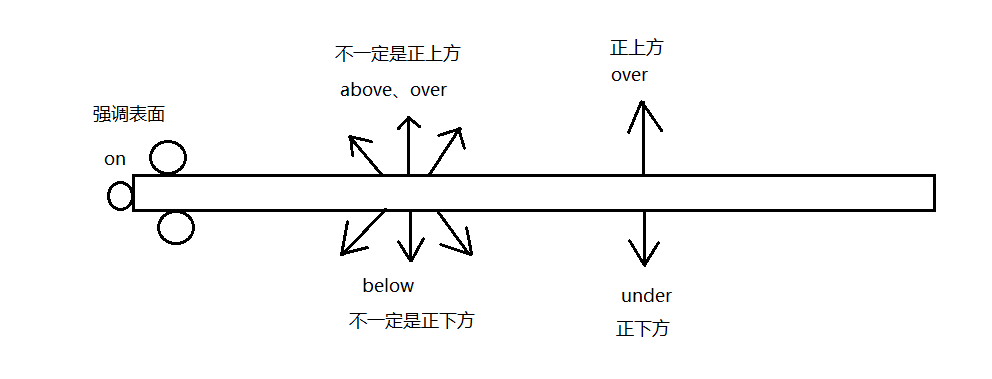

# unit20 介系词

## 一、介系词的功能

#### 1.1 当形容词：修饰名词

- Look at the sentences `on the blackboard.`

  看黑板上的句子。 `当形容词修饰前面的sentences`  

#### 1.2 当副词：表示时间、地点、条件、原因、方法......

- Write the sentences down `on the blackboard. `

  把句子写在黑板上。    `当副词表示地点` 

## 二、表示“时间”的介系词

#### 2.1 at / on / in（在......） 

- at + 时刻、年龄、正午、半夜   

- at the age of live.   在5岁的时候  

- at noon.   正午12点  

- at night.   半夜12点 

- on + 特定的日期、星期......、.....月......日 

- in + 年、月、周、季节、早上、下午、晚上  

  `注意：只有月份的时候使用in,月份后面出现日则需要使用on`   

#### 2.2 at / on /in 的例句

- I'll see her `in` the afternoon.

  我下午将去看他。  

- I'll see her `on` Sunday afternoon. 

  我在周日下午（特定的日期）去看他。

- We went to the zoo `in` July.

  我们七月去过动物园。

- We went to the zoo `on` July 3. 

  我们七月三号去过动物园。

- They arrived `in` the morning.

  他们在早上抵达。

- They arrived `on` the morning of October 10. 

  他们在10月10号的早上抵达。

- She is `at` the age of 11. 

  她11岁了。

- She is eleven years old. 

  她11岁了。 // 注意介系词的用法 

- My English class begins `at` eight o'clock. 

  我的英文课是8点开始的。

- My English class begins `in` spring., 

  我的英文课是春天开始的。

#### 2.3 不可搭配介系词的情况

> 时间名词前加last、next、this、that时，不能再搭配介系词

`比如：morning是名词，介系词可以接名词，而this morning是副词，副词不能直接跟在介系词之后`    

- He's going to leave next week. 

  他下个星期将要离开。 

- I've met him this morning. 

  我在早上遇见他。

#### 2.4 before（在....之前） / by（在....之前） 

- Please arrive `by（= not later than）`10 o'clock.

  请`不晚于`10点之前抵达。`包含10点，小于等于`  

- Please arrive `before（= earlier than）`10 o'clock. 

  请在10点`之前`抵达。`(不包含10点) 小于 ` 

#### 2.5 in（经过....之后）/ with（在....之内） 

> in -> 表示经过的时间的长度

> within -> 表示在时间期限之内  

- 我过几天回来。

  I'll be back in a few days. 

- 我一个小时之内会回来。

  I'll come back within an hour. 

#### 2.6 for（持续）/ during（在.....期间）

> for -> 表示动作或状态持续的时间长度

> during -> 表示在某短时间当中的某一时刻 

- 他们会停留几天。

  They will stay for a few days. 

  `stay当动词表示停留的动作`    

- 在他停留期间我会带他去那地方。

  I'll take him to that place during his stay. 

  `stay当名词表示停留的状态`  

#### 2.7 from（从.....）/ since（从......） 

> from -> 表示动作开始的时间点，常用于现在时、过去式、未来式

>  since -> 表示动作从过去某个时间开始，持续到现在，常用于现在完成式

- He works from Monday to Friday.

  他工作从星期一到星期五。

- I have been busy since yesterday. 

  我从昨天就很忙。

  `busy形容词有三级没有三态，所以have后面使用been`   

## 三、表示“地点”的介系词

#### 3.1 at / in 

> at：表示确切的地点

> in：表示大范围的地点

- The train stopped `at` Taipei Station.

  火车停靠在台北车站。

- This book is published `in` Paris. 

  这本书在巴黎出版。

#### 3.2 in / on / at

> in + 都市名、国名 

> on + 街名

> at + 门牌号码

- He lives `in` Taipei.

  他住在台北。

- He lives `on` Roosevelt Road. 

  他住在罗斯福路。

- He lives `at` 75 Roosevelt Road. 

  他住在罗斯福路75号。

`英语地点排列的顺序：` 从小到大，介系词放小地点前面，使用哪个介系词也以小地点为准。

#### 3.3 on / above / over（在....上）/ under、below（在....下）

> under是over的相反词、below是above的相反词

##### 3.3.1 on：表示一样东西只接触另一样东西的部分表面

- There is a book `on` the desk.

  有一本书在桌子上方。

- Look at the picture `on` the wall.

  看挂在墙上的那张照片。

- There are several files `on` the ceiling.

  天花板上有几个苍蝇。

##### 3.3.2 above：表示不接触而高于某表面，也可以用over 

- She held an umbrella `over / above` her daughter's head. 

  她在她女儿的头上撑了一把伞。

- There is usually a supermarket `below` a department store.

  百货公司下面通常有一家超市。

##### 3.3.3 over：表示接触到某表面的全部

- He spread a cloth `over` the table.

  他铺了一块布在桌子上面。

- The basketball is `under` the chair.

  篮球在椅子下方。

#### 3.4 between / among（在....之间）

> between -> 在两者之间

> among -> 在三者（或三者以上）之间

- Mr.White sat `between` his wife and daughter. 

  怀特先生坐在他妻子和女儿之间

- She failed to find his little brother `among` the crowd. 

  她未能在人群中找到他的弟弟。 

#### 3.5 near（在....附近）、by（在....旁边）、beside（在....旁边）、around（在....四周）

> by -> 表示“前后、左右”的位置

> beside -> 表示左右的位置关系，更强调在同一平面上

- There is a good restaurant `near` my house.

  有一家特别好的餐厅在我的家附近。

- He was sitting `by` the window.

  他坐在窗边。

- Nobody wanted to sit `beside` Nancy. 

  没有人想坐在Nancy旁边。

- There are many students `around` the tree. 

  树的四周有许多学生。

#### 3.6 front与back的用法

> in front of、in the front of    在.....之前 

> in back of、in the back of、behind（在.....之后）

`加the表示内部，不加the表示外部整体`

- There is a tall tree `in front of` the classroom.

  教室的前面有一颗高高的树。 （教室`外部的`前面没有the） 

- There is a blackboard `in the front of` the classroom. 

  教室的前面有一块黑板。（教室`内部的`前面加the表示内部） 

- There is a tall tree `in front`. 

  前面有一颗高高的树。（注意没有参照物of要一起省略）

- He stood `behind` his master. 

  他站在他主人的后面。 `也可以换成in back of`   

#### 3.7 behind和before有何不同？

> behind（在....之后）-> 可以表示“时间、地点”

> before（在.....之前）-> 只能表示“时间”

- A car has stopped **before** the store. 

  `错误写法，before不能地点`

- A car has stopped **in front of** the store. 

  在商店前面停着一辆车。

#### 3.8 along（沿着）、across（穿越）、through（通过）

- Let's take a walk **along** the river. 

  让我们沿着河边散步。

- He went **across** the street. 

  他穿越马路。

- Our train is running **through** a tunne.

  我们的火车正在穿越隧道。

#### 3.9 from（从....）、to（到....）、for（前往）、toward（朝着）

- She went **to** the station.

  他去车站。（人会进到车站里，指的是终点） 

- She went **toward** the station.

  他朝着车站的方向走。（不一定会进入车站，纯粹指的是方面） 

- They've left **for** England. 

  他们已经前往英国了。

- We started **from** Taipei. 

  我们从台北出发。（指的是起点）

#### 3.10 into（向....里面）、out of（在....之外） 

> into和out of一般都指“动态的”丢进来或者拿出去，而in则是“静态的”在里面

- Mary hurried **into** her room.

  Mary匆忙进入她的房间。

- I jumped **out of** the bed. 

  我从床上跳起来。

## 四、重要的介系词

#### 4.1 in

##### 4.1.1 在....（地） 大地点

- Tom lives in New York. 

  Tom居住在纽约。

##### 4.1.2 在....（时）

- I have never seen snow in my life. 

  我一生都没有见过雪。

##### 4.1.3 在.....（时）之后

- She will get well in a week `or so.（大约） `

  她大约一个礼拜之后会康复。

##### 4.1.4 用....（语言；材料）

- Sign your name in English.

  用英文来签名。

##### 4.1.5 在.....（状态中） 

- I am always in good health. 

  我一向身体都很好。

##### 4.1.6 穿戴者

- I don't like the man [in the red tie.]

  我不喜欢那个打着红色领带的男人。

#### 4.2 on

##### 4.2.1 在.....上面

- Don't sit on the floor. 

  不要坐在地板上。

##### 4.2.2 在.....（时） 

- I was born on October 3. 

  我出生在10月3号。

##### 4.2.3 在.....（状态中）

- The house is on fire. 

  这栋房子着火了。

  `on sale: 特价中` 

  `in也可以表示在....状态中，上面两个使用on表示的片语直接记下来`    

##### 4.2.4 关于

- Miss Wang read a book on（= about）animals. 

  王老师读了一本关于动物的书籍。

  `注意这句的动词read是过去式，如果是现在时，那么主词三单，动词需要加s` 

##### 4.2.5 依靠....（方法；手段） 

- Chinese live on rice. 

  中国人以米食为生。

#### 4.3 at 

##### 4.3.1 在....（地）  小范围

- I met him at the corner of the street. 

  我在街的转件处遇见他。

##### 4.3.2 在....（时）.....点.....分

- Our school begins at 8:20. 

  我们学校8:20开始上课。

##### 4.3.3 对准....（目标） 

- The boy threw the bone at the dog. 

  男孩对着狗狗丢骨头。 

##### 4.3.4 听到；看到（表示原因） 

- I was surprised at the news. 

  听到这个消息，我很震惊。

##### 4.3.5  以....（速度；温度；价格）

- I sold my car at a high price. 

  我以高价卖出我的车。

  `注意事项：`price价格的高低只能用high或者low，不能使用expensive或者cheap

#### 4.4 for 

##### 4.4.1 ....之久（表时间） 

- I've been here for three hours. 

  我在这里已经待了3个小时了。

##### 4.4.2以....而言 

- The girl is tall for her age

  对于这个女孩的年龄来看，她的个子是高的。

##### 4.4.3 给....（人） 

- The present is for you. 

  这份礼物是给你的。

##### 4.4.4 前往

- I took the train for ShangHai. 

  我搭火车前往上海。

##### 4.4.5 由于；为了（表原因） 

- The town is famous for its old castle. 

  这个城镇由于古堡而闻名。

##### 4.4.6 famous的两种用法 

> be famous for + 特色    以....特色而闻名

> be famous as + 身份      以....身份而闻名

- A-mei is famous for her good voice. 

  阿妹以她的好嗓音而闻名。

- A-mei is famous as a singer. 

  阿妹以她的歌手身份而闻名。

#### 4.5 to

##### 4.5.1 到....（地） 

- All roads lead to Rome. 

  条条大路通罗马。

##### 4.5.2 到...（时） 

- We stayed there to the end of May. 

  我们在那里待到五月底。

##### 4.5.3 对....（表动作的对象） 

- Listen to me. 

  听我说。

##### 4.5.4 为了....（表目的）

- To your health.

  祝你健康。

#### 4.6 with 

##### 4.6.1 和....一起 

- Mix the sugar with the eggs. 

  把糖和蛋混合在一起。

##### 4.6.2 用....工具

- He cut down the tree with an ax. 

  他用斧头砍下这棵树。

##### 4.6.3 附有......

- I saw a house with a red roof. 

  我看到了一间有红色屋顶的房子。

##### 4.6.4 关于

- What's the matter (with) you? 

  你怎么了？ 

##### 4.6.5 在....身上 / 手上  

- I have little money with me.

  我身上几乎没有钱。

##### 4.6.6 随着

- Languages grow and change with time. 

  语言会随着时间成长和改变。

#### 4.7 of  

##### 4.7.1 .....的

- The door of the room is open.

  房间的门是开着的。

##### 4.7.2 .....当中的

- She is one of the members. 

  她是会员之一。

##### 4.7.3 以.....构成

- She is wearing a dress of silk. 

  她穿着一件丝织的洋装。

##### 4.7.4 made的两种用法

> be made of + 物理变化     由....制成

> be made from + 化学变化    由....制成

- The desk is made of wood. 

  桌子由木材制成。

- Wine is made from grapes. 

  葡萄酒由葡萄制成。

##### 4.7.5   ....之量的（常用于单位之中） 

- I drank a cup of coffee at breakfast. 

  我在早餐的时候喝了一杯咖啡。（我还有吃其他东西）

- I drank a cup of coffee for breakfast. 

  我喝了一杯咖啡当早餐。（我没有吃其他任何东西）

#### 4.8 by

##### 4.8.1 在.....旁边

- The house is by the roadside. 

  这间房子位于路边。

##### 4.8.2 被....（表行为者） 

- She was bitten by a dog. 

  她被狗咬了。

##### 4.8.3 用....（方法；手段）

- I made money by selling fruit. 

  我借由卖水果赚钱。`介系词后面不能跟动词，所以加ing变成名词`

##### 4.8.4 不晚于.....   (表期限)

- I have to be home by ten o'clock. 

  我必须10点之前回家。

##### 4.8.5 乘坐.....（交通工具）

- We go to school by bus. (= on a bus.) 

  我们搭公车上学。

  `注意事项：`用by的时候后面只能接原形，用on的时候如果是单数要表明冠词，如果是复数要加s

##### 4.8.6 以....为基准 

- What time is it by your watch? 

  以你的表来看现在几点了？ 

##### 4.8.7 只差....（表差异或程度）

- He is older than I by two years. 

  = He is two years older than I.
